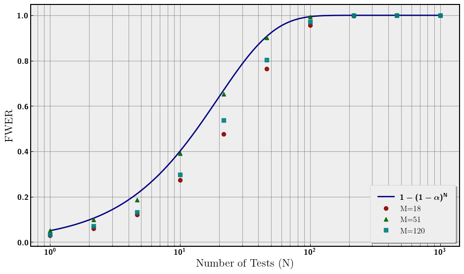
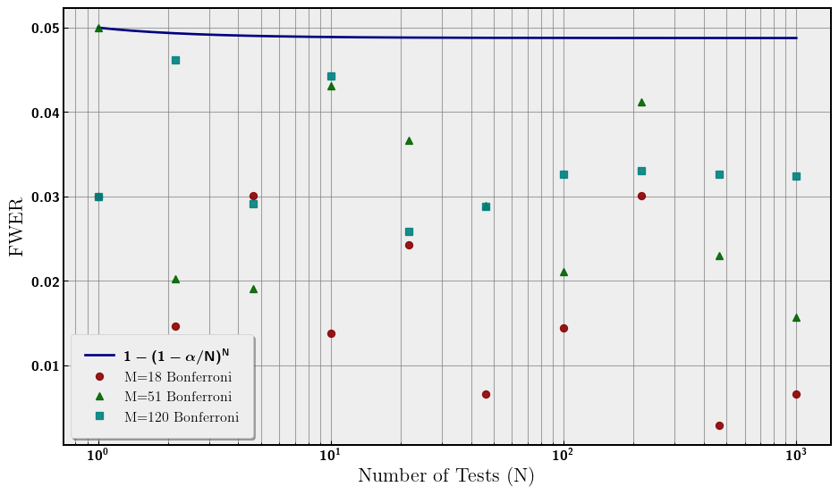

# Multiple Testing Problem
Evan Frangipane

- [Problem Statement](#problem-statement)
- [Outlining the Simulation](#outlining-the-simulation)
- [Discrepancy in FWER](#discrepancy-in-fwer)
- [Correcting Significance](#correcting-significance)

## Problem Statement

The main idea of the multiple testing problem is the more statistical
tests we perform during an analysis, the higher our false positive rate
(Type I Error), if left uncorrected. Imagine we choose our confidence
level to be
,
essentially we are choosing our false positive rate to be
 for one test.
If we test again, the probability of at least one false positive is
").
If we continue testing until
, we can rewrite the
false positive probablity (at least one) as
^N").
This probability is called the family-wise error rate (FWER). As
 increases, the FWER
increases to probability of
. If we allow this
problem to get out of hand, we could be making false inferences.

## Outlining the Simulation

For our simulation we will be flipping fair coins. We are doing a
two-tailed test to see if the number of heads is significantly different
from the number of tails. Some parameters:

-  - number of coins
  being flipped in each test
-  -
  significance for each test
-  - number of tests
  performed
-  -
  number of repetitions of each analysis

So, the total number of coins flipped in each analysis is
.
We choose
,
and
![N \in \[1, 1000\]](https://latex.codecogs.com/svg.latex?N%20%5Cin%20%5B1%2C%201000%5D "N \in [1, 1000]")
for the following plots.

<details class="code-fold">
<summary>Code</summary>

``` python
import numpy as np
import matplotlib.pyplot as plt
import random
from scipy.stats import binom
from matplotlib import rcParams
import pickle

plt.rc('text', usetex=True)
plt.rc('axes', linewidth=2)
rcParams['font.family'] = 'serif'
plt.rc('font', weight='bold')
plt.rcParams['text.latex.preamble'] = r'\usepackage{sfmath} \boldmath'
#rcParams['font.serif'] = ['Times New Roman']  
rcParams['font.size'] = 14 
rcParams['axes.titlesize'] = 16  
rcParams['axes.labelsize'] = 14  
rcParams['legend.fontsize'] = 12  
rcParams['xtick.labelsize'] = 12  
rcParams['ytick.labelsize'] = 12  
plt.style.use('bmh')

with open('fwer.pkl', 'rb') as f:
    fwer_1, fwer_2, fwer_3, M_list, fwer_b1, fwer_b2, fwer_b3, \
    fwer_N, fwer_bound, fwer_bound_N, fwer_bound_b, Ms, \
    pvs, index = pickle.load(f)
```

</details>

We plot the results of our analyses in
<a href="#fig-fwer" class="quarto-xref">Figure 1</a>. The false positive
rate (FWER) increases toward
 with
. The three choices of
 are plotted along with
the analytical curve. There is a discrepancy between the analytical
curve and the numerical simulations that is smallest for
.
We will return to this in the next section. The relevant feature is the
monotonic increase in Type I Error.

<details class="code-fold">
<summary>Code</summary>

``` python
fig, ax = plt.subplots(figsize=(10, 6))
ax.plot(fwer_bound_N, fwer_bound, label=r'$1 - (1 - \alpha)^N$', color='navy')
ax.plot(fwer_N, fwer_1, 'o',label=f'M={M_list[0]}', \
    color='darkred', markersize=6, alpha=0.9)
ax.plot(fwer_N, fwer_2, '^',label=f'M={M_list[1]}', \
    color='darkgreen', markersize=6, alpha=0.9)
ax.plot(fwer_N, fwer_3, 's',label=f'M={M_list[2]}', \
    color='teal', markersize=6, alpha=0.9)

ax.set_xlabel('Number of Tests (N)')
ax.set_ylabel('FWER')
ax.set_xscale('log')

ax.legend(loc='lower right', frameon=True, shadow=True, borderpad=1)
ax.grid(which='both', linestyle='-', linewidth=0.8, color='gray', alpha=0.7)
#plt.title('Family-Wise Error Rate vs. Number of Tests')
for spine in ax.spines.values():
    spine.set_edgecolor('black')
    spine.set_linewidth(1.5)

plt.tight_layout()
plt.show()
```

</details>

<div id="fig-fwer">



Figure 1: Uncorrected FWER

</div>

## Discrepancy in FWER

Our 
significance was chosen to be
 for this
analysis. However, when we are dealing with coin flips we are using
discrete data and not continuous. This has consequences for what
constitutes a significant result for flipping
 coins. For a
significant result we need the p-value of the number of heads (or tails
hence two-tail test) to be the largest number less than
.
We call this number of heads the critical number of heads. However, due
to discrete data, the critical p-value can vary greatly rather than
being exactly .
One would expect that as the number of coin flips increases, the
critical p-value should approach
. The intuition
being as we increase the number of coins flipped we are filling in the
discrete data set and approaching continuum. We plot the critical
p-value for increasing 
coin flips in <a href="#fig-crit" class="quarto-xref">Figure 2</a>.
Additionally, we also plot the three
 values from the
previous simulation and they show the same hierarchy as seen in
<a href="#fig-fwer" class="quarto-xref">Figure 1</a>. The closer the
critical p-value is to
, the closer
the FWER is to
^N").

<details class="code-fold">
<summary>Code</summary>

``` python
colors = ['red', 'green', 'cyan']
labels = [f'M={M_list[0]}', f'M={M_list[1]}', f'M={M_list[2]}']
fig, ax = plt.subplots(figsize=(10, 6))
ax.plot(Ms, pvs, color='navy', label='Critical p-Value', alpha=0.8)
ax.axhline(0.05, color='black', label=f'$\\alpha = 0.05$')
plt.plot([Ms[index[0]]], [pvs[index[0]]], 'o', label=labels[0], \
    color='darkred', markersize=8, zorder=2)
plt.plot([Ms[index[1]]], [pvs[index[1]]], '^', label=labels[1], \
    color='darkgreen', markersize=8, zorder=2)
plt.plot([Ms[index[2]]], [pvs[index[2]]], 's', label=labels[2], \
    color='teal', markersize=8, zorder=2)
ax.set_xscale('log')
ax.set_xlabel('M')
ax.set_ylabel('p-value')
#plt.title('p-value of Critical Integer $(p_{\\text{crit}}< \\alpha)$')
ax.legend(loc='lower right', frameon=True, shadow=True, borderpad=1)
ax.grid(which='both', linestyle='-', linewidth=0.8, color='gray', alpha=0.7)
for spine in ax.spines.values():
    spine.set_edgecolor('black')
    spine.set_linewidth(1.5)

plt.tight_layout() 
plt.show()
```

</details>

<div id="fig-crit">


Figure 2: Critical p-value

</div>

## Correcting Significance

A simple solution to this problem is to scale our choice of
 for
each test by the number of tests. The simplest correction is the
Bonferroni correction, which is simply
.
This comes from taking the Taylor Expansion of the FWER equation with
small parameter
.

^N \rightarrow 1 - (1 - N*\alpha + \mathcal{O}(\alpha^2)) = N*\alpha + \mathcal{O}(\alpha^2)")

Given this expansion, a natural redefinition of
 is

such that the first term in the expansion is our new
.
This redefinition bounds the FWER to
 rather than
asymptoting to . Now the
entire analysis has a significance of
, while each
individual test has a smaller significance scaled by the number of
tests. Now, we redo the analysis with our new significance to confirm
that FWER is around or less than
. This can be
seen in <a href="#fig-fwer-bon" class="quarto-xref">Figure 3</a>. Notice
that there is no clear hierarchy between the three choices of
, this can be explained
by <a href="#fig-crit" class="quarto-xref">Figure 2</a> again, where
this time because

depends on , the
critical p-values will vary with
 and thus the hierarchy
will vary.

<details class="code-fold">
<summary>Code</summary>

``` python
fig, ax = plt.subplots(figsize=(10, 6))

ax.plot(fwer_bound_N, fwer_bound_b, label=r'$1 - (1 - \alpha/N)^N$', \
    color='navy', linewidth=2)
ax.plot(fwer_N, fwer_b1, 'o', label=f'M={M_list[0]} Bonferroni', \
    color='darkred', markersize=6, alpha=0.9)
ax.plot(fwer_N, fwer_b2, '^', label=f'M={M_list[1]} Bonferroni', \
    color='darkgreen', markersize=6, alpha=0.9)
ax.plot(fwer_N, fwer_b3, 's', label=f'M={M_list[2]} Bonferroni', \
    color='teal', markersize=6, alpha=0.9)

ax.set_xlabel('Number of Tests (N)')
ax.set_ylabel('FWER')
ax.set_xscale('log')

ax.legend(loc='lower left', frameon=True, shadow=True, borderpad=1)
ax.grid(which='both', linestyle='-', linewidth=0.8, color='gray', alpha=0.7)

for spine in ax.spines.values():
    spine.set_edgecolor('black')
    spine.set_linewidth(1.5)

plt.tight_layout()
plt.show()
```

</details>

<div id="fig-fwer-bon">



Figure 3: Bonferroni Corrected FWER

</div>
