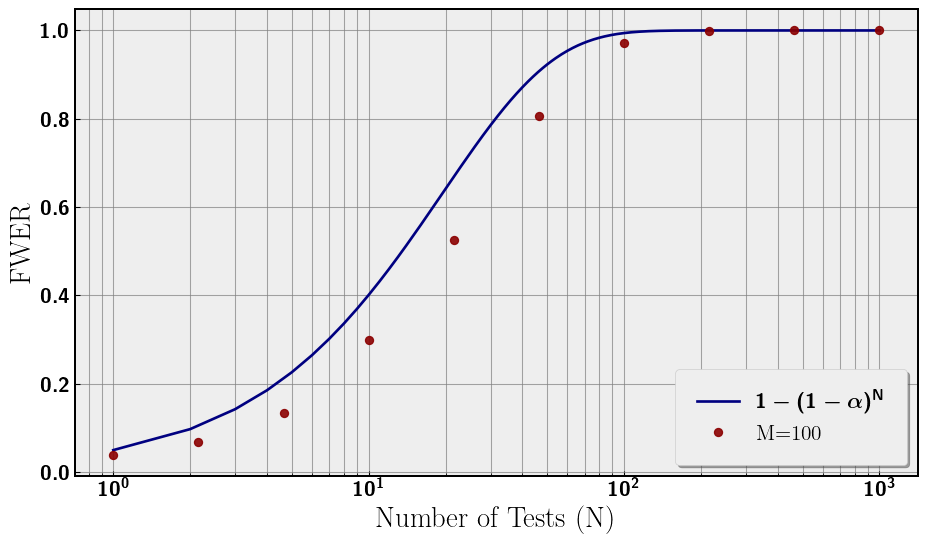
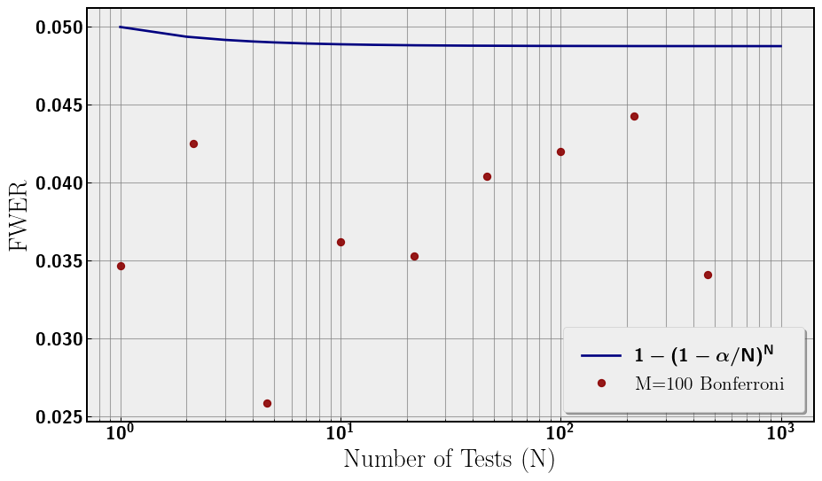
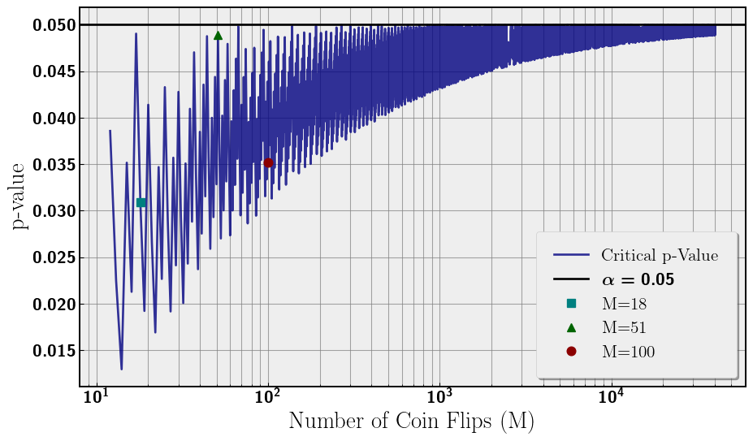

# Multiple Testing Problem
Evan Frangipane

## Abstract

In this article I will describe the multiple testing problem, simulate a
simple example, and outline a solution called the Bonferroni correction.

## What is the Multiple Testing Problem?

The main idea of the multiple testing problem is the more statistical
tests we perform during an analysis, the higher our false positive rate
(Type I Error). Imagine we choose our confidence level to be 95%,
essentially we are choosing our false positive rate to be 5% for one
test. If we test again, the probability of at least one false positive
is 1 − (0.95 ⋅ 0.95) = .0975 \> 0.05 (one minus the probability of no
false positives).

If we continue testing until *N*, we can rewrite the probablity (at
least one false positive) as 1 − (1 − 0.05)<sup>*N*</sup>. This
probability is called the family-wise error rate (FWER). As *N*
increases, the FWER increases to probability of 1. If we allow this
problem to get out of hand, we could be making false inferences.

## Outlining the Simulation

For our simulation we will be flipping fair coins. We are doing a
two-tailed test to see if the number of heads is significantly different
from the number of tails. Some parameters:

- *M* - number of coins being flipped in each test
- *α* = 0.05 - significance for each test
- *N* - number of tests performed
- *n* = 10000 - number of repetitions of each analysis

So, the total number of coins flipped in each analysis is
*M* ⋅ *N* ⋅ *n*. We choose *M* = 100, and *N* ∈ \[1, 1000\] for the
following plots.

``` python
import numpy as np
import matplotlib.pyplot as plt
import random
from scipy.stats import binom
from matplotlib import rcParams
import pickle

plt.rc('text', usetex=True)
plt.rc('axes', linewidth=2)
rcParams['font.family'] = 'serif'
plt.rc('font', weight='bold')
plt.rcParams['text.latex.preamble'] = r'\usepackage{sfmath} \boldmath'
#rcParams['font.serif'] = ['Times New Roman']  
rcParams['font.size'] = 18 
rcParams['axes.titlesize'] = 20  
rcParams['axes.labelsize'] = 18  
rcParams['legend.fontsize'] = 16  
rcParams['xtick.labelsize'] = 16  
rcParams['ytick.labelsize'] = 16  
plt.style.use('bmh')

# let's setup some constants
random.seed(42)
P = 0.5
ALPHA = 0.05
M = 100
n = 10000

def asymp(N_, n_, M_, alpha_): # asnymptotic false positive simulation
    results = np.random.randint(0, 2, size=(n_, N_, M_))
    evens = np.sum(results % 2 == 0, axis=2)
    temp_binomial = binom(M_,P)
    temp_crit = int(temp_binomial.ppf(alpha_ / 2)-1.)
    false_positives = np.sum((evens <= temp_crit) | (evens >= M_ - temp_crit),\
        axis=1) > 0
    return np.mean(false_positives)

# run three samples with low, med, and high M coin flip
fwer_N = np.logspace(0,3,10)
fwer_numer = [asymp(int(i), n, M, ALPHA) for i in fwer_N]

# analytic FWER
fwer_bound_N = np.linspace(1, 1000, 1000) 
fwer_bound = 1 - (1 - ALPHA)**fwer_bound_N
```

We plot the results of our analysis in
<a href="#fig-fwer" class="quarto-xref">Figure 1</a>. The false positive
rate (FWER) increases toward 1 with *N*. The choice of *M* = 100 is
plotted along with the analytical curve. There is a discrepancy between
the analytical curve and the numerical simulations that tends to zero at
large *N*. We will return to subtlety later in this note. For now, the
relevant feature is the monotonic increase in Type I Error, the false
positive probability with the number of tests.

``` python
fig, ax = plt.subplots(figsize=(10, 6))
ax.plot(fwer_bound_N, fwer_bound, label=r'$1 - (1 - \alpha)^N$', color='navy')
ax.plot(fwer_N, fwer_numer, 'o',label=f'M={M}', \
    color='darkred', markersize=6, alpha=0.9)

ax.set_xlabel('Number of Tests (N)')
ax.set_ylabel('FWER')
ax.set_xscale('log')

ax.legend(loc='lower right', frameon=True, shadow=True, borderpad=1)
ax.grid(which='both', linestyle='-', linewidth=0.8, color='gray', alpha=0.7)

for spine in ax.spines.values():
    spine.set_edgecolor('black')
    spine.set_linewidth(1.5)

plt.tight_layout()
plt.show()
```



## Correcting Significance

A simple solution to this problem is to scale our choice of *α* for each
test by the number of tests. The simplest correction is the Bonferroni
correction, which is simply *α* → *α*/*N*. This comes from taking the
Taylor Expansion of the FWER equation with small parameter *α*.

1 − (1 − *α*)<sup>*N*</sup> → 1 − (1 − *N* ⋅ *α* + 𝒪(*α*<sup>2</sup>)) = *N* ⋅ *α* + 𝒪(*α*<sup>2</sup>)

Given this expansion, a natural redefinition of *α* is *α* = *α*/*N*
such that the first term in the expansion is 0.05, while the
significance per test is scaled down by *N*. This redefinition bounds
the FWER to 0.05 rather than asymptoting to 1. Now the entire analysis
has a significance of 0.05, which is what we desired by choosing
*α* = 0.05. Now, we redo the analysis with our new significance to
confirm that FWER is around 0.05. This can be seen in
<a href="#fig-fwer-bon" class="quarto-xref">Figure 2</a>.

``` python
# three samples with bonferroni
fwer_bon = [asymp(int(i), n, M, ALPHA/i) for i in fwer_N]

# fwer with adjusted alpha = alpha/N
fwer_bound_bon = 1 - (1 - ALPHA/fwer_bound_N)**fwer_bound_N

fig, ax = plt.subplots(figsize=(10, 6))

ax.plot(fwer_bound_N, fwer_bound_bon, label=r'$1 - (1 - \alpha/N)^N$', \
    color='navy', linewidth=2)
ax.plot(fwer_N, fwer_bon, 'o', label=f'M={M} Bonferroni', \
    color='darkred', markersize=6, alpha=0.9)

ax.set_xlabel('Number of Tests (N)')
ax.set_ylabel('FWER')
ax.set_xscale('log')

ax.legend(loc='lower right', frameon=True, shadow=True, borderpad=1)
ax.grid(which='both', linestyle='-', linewidth=0.8, color='gray', alpha=0.7)

for spine in ax.spines.values():
    spine.set_edgecolor('black')
    spine.set_linewidth(1.5)

plt.tight_layout()
plt.show()
```



## Subtle Discrepancy in Numerical FWER

Our *α* significance was chosen to be 0.05 for this analysis. However,
when we are dealing with coin flips we are using discrete data and not
continuous. This has consequences for what constitutes a significant
result for flipping *M* coins. For a significant result we need the
p-value of the number of heads (or tails hence two-tail test) to be the
largest number less than *α* = 0.05. We call this number of heads the
critical number of heads. However, due to our discrete data, the
critical p-value can vary greatly rather than being exactly 0.05. One
would expect that as the number of coin flips increases, the critical
p-value should approach 0.05. The intuition being as we increase the
number of coins flipped we are filling in the discrete data set and
approaching continuum. We plot the critical p-value for increasing *M*
coin flips in <a href="#fig-crit" class="quarto-xref">Figure 3</a>.
Additionally, we also overlay the critical p-values for
*M* = {18, 51, 100}. The closer the critical p-value is to 0.05, the
closer the FWER is to 1 − (1 − *α*)<sup>*N*</sup>.

``` python
# calculate critical p-vals and overly M = {18, 51, 100}
MLOW = 18
MMED = 51

Ms = np.logspace(np.log(3),np.log(100),10000).astype(int)
bins = [binom(i,P) for i in Ms]
crits = [int(i.ppf(0.05 / 2)-1.) for i in bins]
pvs = [2.*bins[i].cdf(min(Ms[i]-crits[i],crits[i])) for i in range(len(Ms))]
index = [min(range(len(Ms)), key=lambda i: abs(Ms[i]-MLOW)), 
             min(range(len(Ms)), key=lambda i: abs(Ms[i]-MMED)), 
             min(range(len(Ms)), key=lambda i: abs(Ms[i]-M))
             ]

labels = [f'M={MLOW}', f'M={MMED}', f'M={M}']
fig, ax = plt.subplots(figsize=(10, 6))
ax.plot(Ms, pvs, color='navy', label='Critical p-Value', alpha=0.8)
ax.axhline(0.05, color='black', label=f'$\\alpha = 0.05$')
plt.plot([Ms[index[0]]], [pvs[index[0]]], 's', label=labels[0], \
    color='teal', markersize=8, zorder=2)
plt.plot([Ms[index[1]]], [pvs[index[1]]], '^', label=labels[1], \
    color='darkgreen', markersize=8, zorder=2)
plt.plot([Ms[index[2]]], [pvs[index[2]]], 'o', label=labels[2], \
    color='darkred', markersize=8, zorder=2)
ax.set_xscale('log')
ax.set_xlabel('Number of Coin Flips (M)')
ax.set_ylabel('p-value')
#plt.title('p-value of Critical Integer $(p_{\\text{crit}}< \\alpha)$')
ax.legend(loc='lower right', frameon=True, shadow=True, borderpad=1)
ax.grid(which='both', linestyle='-', linewidth=0.8, color='gray', alpha=0.7)
for spine in ax.spines.values():
    spine.set_edgecolor('black')
    spine.set_linewidth(1.5)

plt.tight_layout() 
plt.show()
```



Despite *M* = 100 being larger than *M* = 51, the critical p-value is
lower and not all that much larger than *M* = 18 as seen in
<a href="#fig-crit" class="quarto-xref">Figure 3</a>. The critical
p-value rapidly oscillates with number of coin flips (*M*) while slowly
asymptoting to *α* = 0.05 as we would expect. So what does this mean for
FWER?

## Concluding Thoughts

FWER, the false positive rate, increases with the number of statistical
tests performed toward probability 1. We can correct for this by scaling
our individual test *α* by the number of tests. One simple correction is
the Bonferroni correction where *α* → *α*/*N*.

This problem is simply stated and corrected but pervasive especially in
A/B Testing. We can incorrectly make significance claims when the data
does not support our conclusion.

Additionally, I introduced a subtlety of discrete data sets having
widely varying critical p-values. In our analysis, we noticed that our
numerical data did not identically follow the FWER curve in
<a href="#fig-fwer" class="quarto-xref">Figure 1</a>. Further, our data
did not follow 0.05 in
<a href="#fig-fwer-bon" class="quarto-xref">Figure 2</a>. The reason is
our critical p-value being approximately 0.035 rather than 0.05 as seen
in <a href="#fig-crit" class="quarto-xref">Figure 3</a>. This discrete
data plus a somewhat unlucky choice of *M* = 100 leads to the difference
between the FWER expected and our numerical result.

## Addendum

Thanks to
[wikipedia](https://en.wikipedia.org/wiki/Multiple_comparisons_problem)
(wikipedia!! 😮) for inspiring this article and thanks to Bret for
proofreading.
